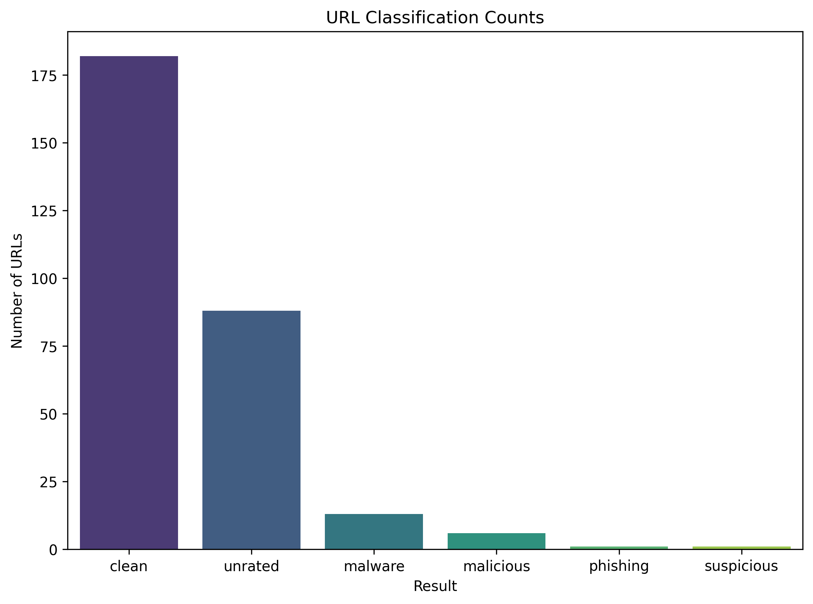
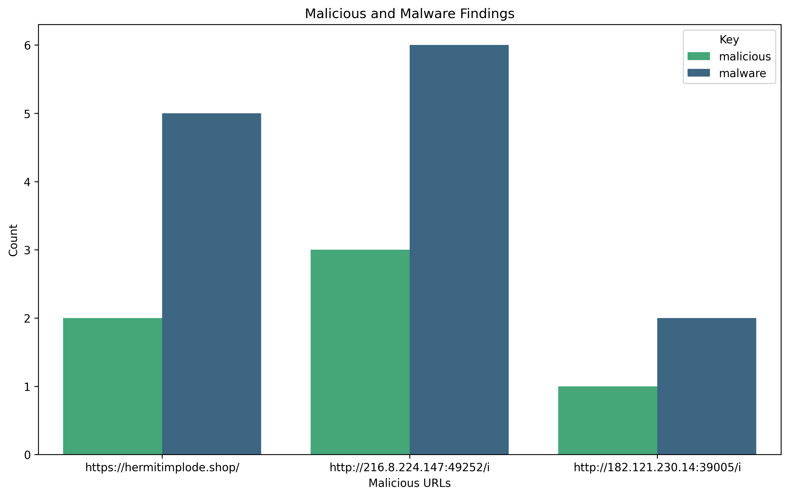

# Blacklight 🔦

Blacklight is a modular threat intelligence aggregator and IOC normalization engine.

It pulls data from multiple open-source threat feeds, standardizes indicators like IPs, domains, and file hashes, and stores them in a unified format for analysis, enrichment, and automation.

[](https://www.python.org/)  
[](LICENSE)

## ✨ Features
- Ingests threat feeds (JSON, CSV, TXT)
- Normalizes indicators across formats
- Stores IOCs in a local SQLite database
- Simple querying via CLI (with search + filters)
- Scalable architecture for adding new feeds

## 🍿 Feeds (Current and Planned)
- [X] URLhaus
- [X] VirusTotal API
- [X] Postgres local

## 🛠 Tech Stack
- Python 3.11+
- `requests`, `pandas`
- Modular architecture for easy feed integration

## 📂 Project Structure
```
blacklight/
├── feeds/           # Individual feed logic
│   └── __init__.py
├── utils/           # Normalization and helpers
│   └── __init__.py
├── ingest.py        # Main ingest runner
├── query.py         # Query/search CLI
├── requirements.txt
└── README.md
```

## ❔ So what's the plan?
1. Parse JSON dump from URLhaus for URLs ✅
2. Connect to VirusTotal API to pull in additional information ✅
3. Save data in Postgres ✅
4. Visualiation 😎 ✅

## High Level Results




## 👓 Author
Created By Winnie Mutunga

This project is open for viewing but not licensed for reuse or redistribution.

